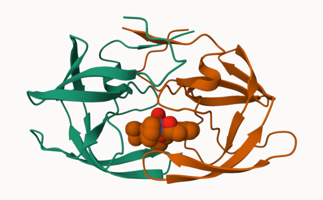
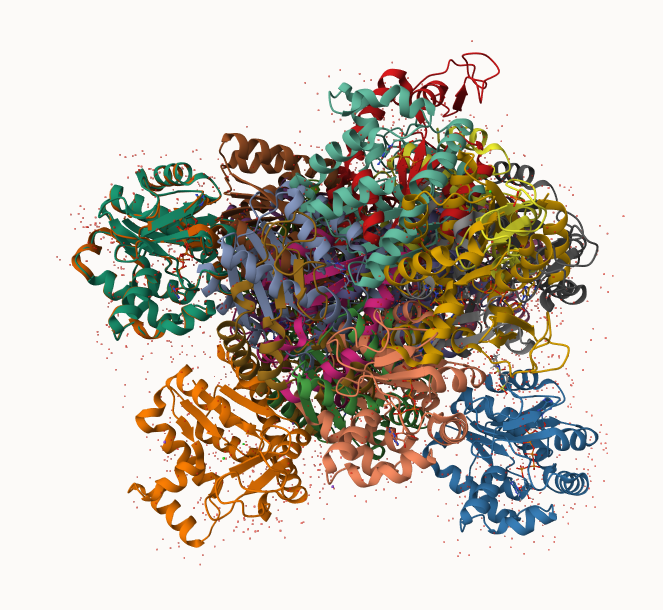

## PDB statistics

The Protein Data Bank (PDB) is the amin repository of biomolecular structures. Let’s see
what it contains:

```{r}
stats <- read.csv("pdb_stats.csv")
stats
```
```{r}
sum(stats$Neutron)
```

The comma in these numbers leads to the numbers here being read as character.

```{r}
c(100,10)
```

```{r}
library(readr)
stats <- read_csv("pdb_stats.csv")
```
```{r}
stats
```

```{r}
sum(stats$`X-ray`)
```

> Q1: What percentage of structures in the PDB are solved by X-Ray and Electron
Microscopy.

```{r}
n.xray <- sum (stats$`X-ray`)
n.em <- sum (stats$`EM`)
n.total <- sum(stats$Total)
n.xray/n.total * 100
```
```{r}
n.em/n.total * 100
```

> Q2: What proportion of structures in the PDB are protein?

```{r}
n.total<- sum(stats$Total)
n.protein <- stats$Total[stats$`Molecular Type`=="Protein(only)"]
n.protein/n.total * 100
```

## Visualizing the HIV-1 protease structure

We can use the Molsat viewer online: https://molstar.org/viewer/

```{r}

```
Figure 1: My first image of HIV-Pr with the surface display showing ligand binding.

A new clean image showing the catalytic ASP25 amino acids in both chains of the HIV-PR
dimer along with the inhibitor and the all important active site water.

## Bio3D Package for Structural Bioinformatics

```{r}
library(bio3d)
pdb <- read.pdb("1hsg")
```
```{r}
pdb
```
```{r}
head(pdb$atom)
```
```{r}
options(repos = c(CRAN = "https://cran.rstudio.com/"))
```
```{r}
#install.packages("pak")
```
```{r}
pak::pak("bioboot/bio3dview")
```
```{r}
#install.packages("NGLVieweR")
```
```{r}
library(bio3dview)
```

## Predicting Functional Motions of a Single Structure

Read an ADK structure from the PDB database!

```{r}
adk <- read.pdb("6s36")
```
```{r}
adk
```
```{r}
m <- nma(adk)
```
```{r}
plot(m)
```

Write our results as a wee trajectory/movie of predicted motions:
```{r}
mktrj(m, file="adk_m7.pdb")
```
```{r}
#Taken from lab document :)
#view.nma(m, pdb=adk)
```
```{r}
#install.packages("png")
```
```{r}
library(png)
library(grid)
img <- readPNG("2HSG.png")
grid.raster(img)
```
```{r}
library(png)
library(grid)
img <- readPNG("1HSG.png")
grid.raster(img)
```

> Q4: Water molecules normally have 3 atoms. Why do we see just one atom per water molecule in this structure?

Although a water molecule has three atoms, X-ray crystallography usually cannot resolve hydrogen atoms because they scatter X-rays very weakly. As a result, only the oxygen atom is visible and recorded for each water molecule in the structure.

> Q5: There is a critical “conserved” water molecule in the binding site. Can you identify this water molecule? What residue number does this water molecule have?

Yes! The water molecule has a residue number of 308.

> Q6: Generate and save a figure clearly showing the two distinct chains of HIV- protease along with the ligand. You might also consider showing the catalytic residues ASP 25 in each chain and the critical water (we recommend “Ball & Stick” for these side-chains). Add this figure to your Quarto document.

```{r}
library(png)
library(grid)
img <- readPNG("3HSG.png")
grid.raster(img)
```
```{r}
pdb <- read.pdb("1hsg")
```
```{r}
pdb
```

> Q7: How many amino acid residues are there in this pdb object?

There are 198 amino acid residues.

> Q8: Name one of the two non-protein residues?

MK1 (indinavir)

> Q9: How many protein chains are in this structure?

There are 2 protein chains in this structure (chains A and B).


## Comparative Analysis with PCA

First step, find an ADK sequence:

```{r}
library(bio3d)
id <- "1ake_A" ## Change this to run a different analysis
aa <- get.seq(id)
```

```{r}
aa
```

Next step, is t search the PDB database for all related entries: 

```{r}
blast <- blast.pdb(aa)
hits <- plot(blast)
```

All the blast results are here for us to see: 
```{r}
head(blast$hit.tbl)
```

The "top hits" are in the `hits` object. Now we can download these to our computer. Put these in a wee sub-folder (directory), called "pdbs" and use grip to speed things up. 

```{r}
# Download releated PDB files
files <- get.pdb(hits$pdb.id, path="pdbs", split=TRUE, gzip=TRUE)
```

These look like a hot mess



Next we will use the `pdbaln()` function to align and also optionally fit (i.e. superpose) the identified PDB structures.

This requires a BioConductor packaged called "msa" that we need to install.
First, we install BiocManager.Then we use `BiocManager::install("msa")`
```{r}
#BiocManager::install("msa")
```

```{r}
# Align related PDBs
pdbs <- pdbaln(files, fit = TRUE, exefile="msa")
```

Have a wee peak at this new "alignment object" `pdbs`

```{r}
pdbs
```

We could view these in R with **bio3dview** `view.pdbs()` function.

```{r}
library(bio3dview)
view.pdbs(pdbs)
```

## PCA

We can run PCA on our `pdbs` object using the `pca()` function from **bio3d**:

```{r}
# Perform PCA
pc.xray <- pca(pdbs)
plot(pc.xray)
```
```{r}
plot(pc.xray, 1:2)
```

We can make a visualization of the major conformational difference (i.e. large scale structure change) captured by our PCA analysis with the `mktrj()` function. 

```{r}
pc1 <- mktrj(pc.xray, file="pca.pdb")
```

Let's see in Mol-star


