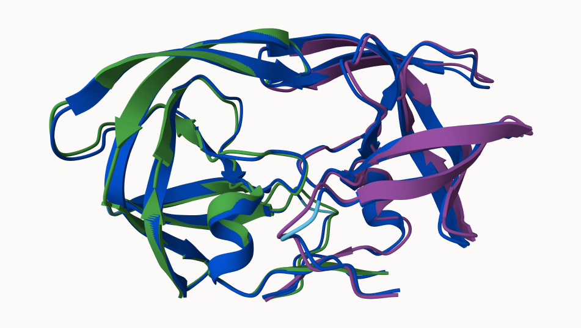

## Background 

We saw last day that the main repository for biomolecular structure (the PDB database) only has ~250,000 entries. 

UniProtKB (the main protein sequence database) has over 200 million entries! 


## AlphaFold

In this hands-on session we will utilize AlphaFold to predict protein structure from sequence (Jumper et al. 2021).

Without the aid of such approaches, it can take years of expensive laboratory work to determine the structure of just one protein. With AlphaFold we can now accurately compute a typical protein structure in as little as ten minutes.

## The EBI AlphaFold Database

The EBI AlphaFold database contains lots of computed structure models. It is increasingly likely that the structure you are interested in is already in this database. < https://alphafold.ebi.ac.uk/ >

There are 3 major outputs for Alphafold

1. A model of structure in **PDB** format.
2. A **pLDDT score**: that tells us how confident the model is for a given residue in your protein (high values are good, above 70)
3. A **PAE score**: that tells us about protein packing quality. 

If you can't find a matching entry for the sequence you are interested in AFDB you can run Alphafold yourself...


## Running AlphaFold

We will use ColabFold to run Alphafold on our sequence < https://github.com/sokrypton/ColabFold > < https://colab.research.google.com/github/sokrypton/ColabFold/blob/main/AlphaFold2.ipynb >

Figure from AlphaFold here!



## Interpreting Results

Custom analyis of resulting models

We can read all the AlphaFold results into R and do more quantitative analysis than just viewing the structures in Mol-star:

Read all PDB models:
```{r}
library(bio3d)
p <- read.pdb("HIVPR_23119_UNRELAXED_RANK_001_ALPHAFOLD2_MULTIMER_V3_MODEL_4_SEED_000.PDB-HIVPR_23119_UNRELAXED_RANK_005_ALPHAFOLD2_MULTIMER_V3_MODEL_3_SEED_000.PDB-HIVPR_23119_UNRELAXED_RANK_002_ALPHAFOLD2_MULTIMER_V3_MODEL_1_SEED_000.PDB-HIVPR_23119_UNR.png")
```

```{r}
pdb_files <- list.files("hivpr_23119/", pattern = ".pdb", full.names = T)

pdbs <- pdbaln(pdb_files, fit=TRUE, exefile="msa")
```

```{r}
library(bio3dview)
#view.pdbs(pdbs)
```

How similar or different are my models?

```{r}
rd <- rmsd(pdbs)

library(pheatmap)
pheatmap(rd)
```

```{r}
library(pheatmap)

colnames(rd) <- paste0("m",1:5)
rownames(rd) <- paste0("m",1:5)
pheatmap(rd)
```


