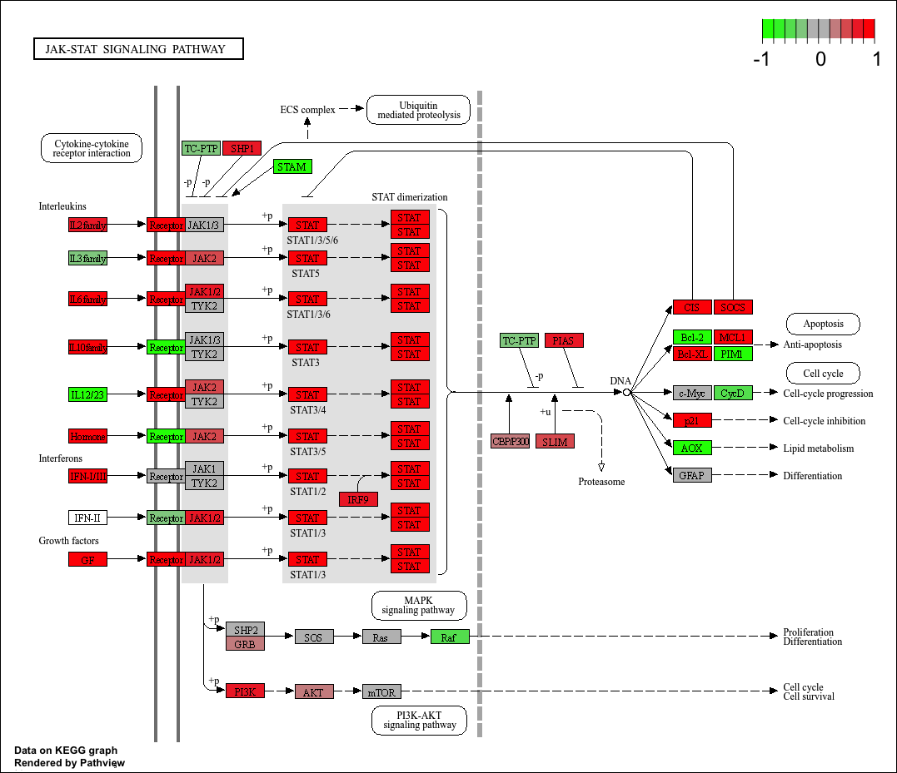

## Background

Our data from today comes from a HOX gene knock-out study. 

> Trapnell C, Hendrickson DG, Sauvageau M, Goff L et al. "Differential analysis of gene regulation at transcript resolution with RNA-seq". Nat Biotechnol 2013 Jan;31(1):46-53. PMID: 23222703

The authors report on differential analysis of lung fibroblasts in response to loss of the developmental transcription factor HOXA1.


## Data Import

We have 2 key input files: counts and metadata

```{r}
library(DESeq2)
```

```{r}
metaFile <- "GSE37704_metadata.csv"
countFile <- "GSE37704_featurecounts.csv"

# Import metadata and take a peek
colData = read.csv(metaFile, row.names=1)
head(colData)
```

```{r}
countData = read.csv(countFile, row.names=1)
head(countData)
```


### Check and Tidy

We need to remove the first "length" column from `countData` to have 1:1 correspondance with with `colData` rows. 

```{r}
countData <- countData[,-1]
```

```{r}
rownames(colData) == colnames(countData)
```

## Remove zero count genes
Some genes (rows) have no count data (i.e. zero values). We should remove these before any further analysis.

```{r}
to.keep <- rowSums(countData) > 0
countData <- countData[to.keep, ]
```


## DESeq Analysis

```{r}
dds <- DESeqDataSetFromMatrix(countData=countData,
                       colData=colData,
                       design=~condition)

dds = DESeq(dds)
dds

head(countData)
```

### Get Results

```{r}
res <- results(dds)
summary(res)
```

```{r}
head(res)
```


## Volcano Plot

Lets add some color to this plot along with cutoff lines for fold-change and P-value

```{r}
library(ggplot2)

# Make a color vector for all genes
mycols <- rep("gray", nrow(res))

# Color blue the genes with fold change above 2
mycols[ abs(res$log2FoldChange) > 2 ] <- "blue"

# Color gray those with adjusted p-value more than 0.01
mycols[ res$padj > 0.01 ] <- "gray"

ggplot(res) +
  aes(log2FoldChange,
      -log(padj)) +
  geom_point(col=mycols) +
  geom_vline(xintercept = c(-2,2)) +
  geom_hline(yintercept = -log(0.01))
```

## Add Annotation

```{r}
library(AnnotationDbi)
library(org.Hs.eg.db)
```

##MapIDs

```{r}
columns(org.Hs.eg.db)

res$symbol = mapIds(org.Hs.eg.db,
                    keys=rownames(res), 
                    keytype="ENSEMBL",
                    column="SYMBOL")

res$entrez = mapIds(org.Hs.eg.db,
                    keys=rownames(res),
                    keytype="ENSEMBL",
                    column="ENTREZID")

res$name =   mapIds(org.Hs.eg.db,
                    keys=rownames(res),
                    keytype="ENSEMBL",
                    column="GENENAME")

head(res, 10)
```

### Save annotated results

```{r}
write.csv(res, file="results_annotated.csv")
```


## Pathway Analysis

```{r}
library(pathview)
library(gage)
library(gageData)

data(kegg.sets.hs)
data(sigmet.idx.hs)

# Focus on signaling and metabolic pathways only
kegg.sets.hs = kegg.sets.hs[sigmet.idx.hs]

# Examine the first 3 pathways
head(kegg.sets.hs, 3)
```

```{r}
foldchanges = res$log2FoldChange
names(foldchanges) = res$entrez
head(foldchanges)
```

```{r}
# Get the results
keggres = gage(foldchanges, gsets=kegg.sets.hs)
```

```{r}
attributes(keggres)
```

```{r}
# Look at the first few down (less) pathways
head(keggres$less)
```

```{r}
pathview(gene.data=foldchanges, pathway.id="hsa04110")
```

```{r}
# A different PDF based output of the same data
pathview(gene.data=foldchanges, pathway.id="hsa04110", kegg.native=FALSE)
```

```{r}
## Focus on top 5 upregulated pathways here for demo purposes only
keggrespathways <- rownames(keggres$greater)[1:5]

# Extract the 8 character long IDs part of each string
keggresids = substr(keggrespathways, start=1, stop=8)
keggresids
```

```{r}
pathview(gene.data=foldchanges, pathway.id=keggresids, species="hsa")
```





## GO analysis

Focus on the Biological Process "BP" section of GO

```{r}
data(go.sets.hs)
data(go.subs.hs)

# Focus on Biological Process subset of GO
gobpsets = go.sets.hs[go.subs.hs$BP]

gobpres = gage(foldchanges, gsets=gobpsets)

lapply(gobpres, head)
```

```{r}
sig_genes <- res[res$padj <= 0.05 & !is.na(res$padj), "symbol"]
print(paste("Total number of significant genes:", length(sig_genes)))
```

```{r}
write.table(sig_genes, file="significant_genes.txt", row.names=FALSE, col.names=FALSE, quote=FALSE)
```

> Q: What pathway has the most significant “Entities p-value”? Do the most significant pathways listed match your previous KEGG results? What factors could cause differences between the two methods?

Organelle fission (GO:0048285) since it has the smallest p-value (1.54 × 10e-15) among all listed GO terms, making it the most statistically significant result. They can be different because GO and KEGG basically group genes in different ways and use slightly different analysis methods. GO focuses on broad biological processes with lots of overlap, while KEGG is more about specific pathways like signaling or metabolism, so even with the same gene data they might highlight different top results.


